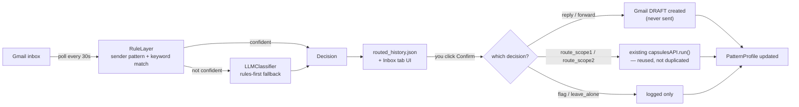

# Intern — Scope #3 Inbox Router: Handoff Notes

**Document Type:** Implementation Handoff
**Date:** August 17, 2026
**Status:** Phase A complete (mock Gmail, fully tested) — Phase B (real Gmail account) not started
**Covers:** `components/inbox_router/`, plus the `app_electron/` visual redesign this branch is built on top of

---

## 1. What this document is for

This scope was built from your own spec, quoted in full so nothing gets lost in translation:

> *"Scope #3 - Reads an inbox and, based on how this user has actually handled similar messages before, decides what each incoming email needs — routed into Scope #1's form-filler, routed into Scope #2's sheet-matcher, replied to directly, forwarded, flagged for a person, or left alone — then confirms the outcome by reply."*

This doc tells you honestly what got built against that spec, where it diverges on purpose, what still needs your input, and what changed in the app's UI along the way (Scope #3 landed on top of a full visual redesign done earlier the same session — you'll see both if you pull this branch).

---

## 2. Did it hit the goal?

| What the spec asked for | Status |
|---|---|
| Reads the inbox | ✅ Built — `GmailClientBase` interface, `MockGmailClient` fully working, `RealGmailClient` written to the real Gmail API shape |
| Decides based on how *this user* has actually handled similar mail before (no manual labeling) | ✅ Built — `PatternProfile.observe_sent_history()` correlates the Sent folder against inbox threads passively; no labeling step anywhere |
| Routes to Scope #1's form-filler | ✅ Built and verified live — rule-layer keyword match against `form_filling`'s real registry keywords fired correctly in a real (non-mocked) test run |
| Routes to Scope #2's sheet-matcher | ⚠️ Built, but **the real `tasks/registry.json` entry for Scope #2 has empty `trigger_keywords`** — so today this decision can only come from the LLM layer, not the rule layer, until either the registry gets keywords or an LLM provider is actually configured (see §6) |
| Reply directly | ✅ Built — draft-only (see next row) |
| Forward | ✅ Built — draft-only, target inferred from the pattern profile's `common_forward_targets` |
| Flag for a person | ✅ Built and verified live — correctly triggered when the LLM layer failed |
| Leave alone | ✅ Built — rule-layer path exists (lopsided ignore pattern), not yet exercised live in the one test run I did (the run only covered ~20s of polling) |
| **"Confirms the outcome by reply"** | ⚠️ **Deliberate deviation, flagging directly to you since you wrote the original line.** Nothing auto-sends. `confirm_suggestion()` only ever creates a Gmail **draft**, and only for the reply/forward decisions — route_scope1/route_scope2/flag/leave_alone get no reply or notification of any kind, just a logged decision. This was the user's explicit call (draft-for-review over auto-send, given a fresh classifier is unproven) — worth you weighing in if the spec actually needs some form of confirmation on every outcome, not just reply/forward. |

**Bottom line:** the decision engine (the actual hard part — passive learning + hybrid classification + routing) is built and works, tested 35 ways plus one real end-to-end process run. The two honest gaps are Scope #2's missing keywords (a one-line registry fix once you want it) and the narrower "confirm" behavior than the spec's literal wording.

---

## 3. Architecture

Draft-only is enforced structurally, not just by convention — `GmailClientBase` has no `send()`/`send_message()` method anywhere in the interface. There is no code path capable of sending real email; the furthest it goes is a Gmail draft.



- **`gmail_client.py`** — `MockGmailClient` (committed fixture, zero credentials needed) and `RealGmailClient` (standard `google-auth-oauthlib` Desktop-app OAuth flow). `get_gmail_client()` picks between them based on whether `components/inbox_router/credentials/client_secret.json` exists on disk — that file existing is the *entire* switch from mock to real.
- **`pattern_profile.py`** — per-sender-domain counters (reply/forward/ignore), built once from Sent-folder correlation, nudged on every confirm/override.
- **`routing_rules.py`** — deterministic first pass. *(Named `routing_rules.py`, not `rules.py` — collided with `components/scope2/rules/`, same class of bug the project already hit once with `recorder/`.)*
- **`llm_classifier.py`** — same multi-provider shape as `LLMAgent` (Anthropic/Groq/Gemini/LM Studio), re-implemented rather than importing `LLMAgent` directly — its provider-calling methods are private and shaped entirely around GUI actions, not a generic classifier. Same choice already made when Scope #2 was integrated.
- **`router.py`** — the orchestrator, spawned as a child process by `app/recorder_bridge.py`, same shape as a capsule Play run, talking JSON-lines over stdin/stdout.

---

## 4. UI changes

Two separate things landed in `app_electron/`, in this order:

### 4a. Full visual redesign ("editorial calm")
Before Scope #3, the whole app was reskinned: near-black ink as the only "primary" color, one reserved clay-red (`#B4441E`) signal meaning *"the agent has control of your mouse and keyboard right now"* — used nowhere else. Archivo + JetBrains Mono, self-hosted. New Home/Tasks/Running/Finished states plus a full-window Handover overlay before any live automation run. Vocabulary: "workflow" → **task**, "capsule/session" → **take**. All existing IPC/functionality preserved — this was a reskin over the real app, not a rewrite. Token system lives in `app_electron/renderer/tokens.css`.

### 4b. New Inbox tab (Scope #3)
A third sidebar icon next to Home/Tasks. Deliberately **no clay anywhere in it** — a routing decision being made isn't "the agent has your mouse," so it reuses ink/success/muted/accent-blue only. Each routed email shows as a row: subject, sender, a plain-language decision chip, the rationale, and a Confirm button for anything still pending. Start/Stop controls the background poller; a small label states plainly whether it's running against mock or live Gmail.

---

## 5. Try it right now (Phase A — safe, mock data only)

```bash
cd app_electron
npm start
```
Click the Inbox icon → **Start**. It'll bootstrap the pattern profile from the committed `mock_inbox.json` fixture (6 emails covering all 6 outcomes) and start routing within a few seconds. This is 100% safe to click — `credentials/client_secret.json` doesn't exist yet, so it structurally cannot reach a real Gmail account.

Run the test suite: `pytest tests/test_inbox_router.py tests/test_recorder_bridge_inbox_router.py -v`

---

## 6. Going live (Phase B — needs one of you, not Claude)

1. Create a Google Cloud project, enable the Gmail API.
2. Create an OAuth 2.0 **Desktop app** client, download the JSON.
3. Save it as `components/inbox_router/credentials/client_secret.json` (gitignored).
4. Start the Inbox Router again — `get_gmail_client()` will pick `RealGmailClient` automatically, and the first run opens a real browser for your own Google consent. `token.json` gets generated after that; no browser needed on subsequent runs.

If you want Scope #2 reachable via the rule layer instead of only the LLM fallback, add real `trigger_keywords`/`trigger_apps` to its `tasks/registry.json` entry — the rule layer already reads that file directly, no code change needed.

---

## 7. Files touched

`components/inbox_router/` (new package — `router.py`, `gmail_client.py`, `pattern_profile.py`, `routing_rules.py`, `llm_classifier.py`, `data/mock_inbox.json`), `app/recorder_bridge.py` (additive — new inbox commands, zero existing handlers touched), `app_electron/{main.js,preload.js,renderer/*}` (additive IPC + new Inbox tab), `requirements.txt` (+5 packages), `.gitignore` (+credentials/pattern-profile rules), `DEVELOPERS.md` + `treetask/index.html` (Scope #3 reframed as this approach), `tests/test_inbox_router.py` + `tests/test_recorder_bridge_inbox_router.py` (35 tests, all passing, zero regressions on the full suite).
